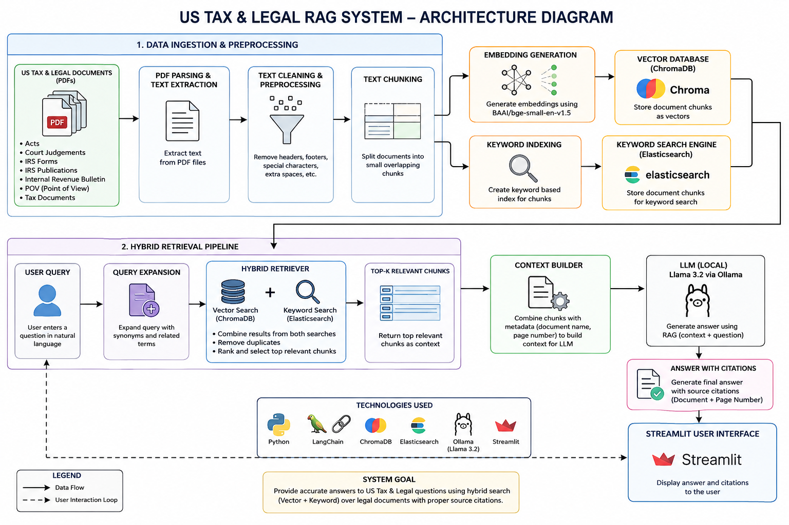

# ⚖️ US Tax & Legal RAG System

A Hybrid Retrieval-Augmented Generation (RAG) system for answering questions from US Tax & Legal documents using **ChromaDB**, **Elasticsearch**, **Ollama**, and **Streamlit**.

The system combines semantic retrieval with keyword-based search to provide accurate answers along with document-level citations. All inference is performed locally using **Llama 3.2** through **Ollama**, ensuring privacy and eliminating dependency on external APIs.

---

# Project Overview

Legal and tax documents are often large, complex, and difficult to search manually. Traditional keyword search frequently misses semantically relevant information, while vector search alone may overlook exact legal terminology.

This project addresses these limitations by implementing a **Hybrid Retrieval-Augmented Generation (Hybrid RAG)** pipeline that combines:

- Semantic Search using ChromaDB
- Keyword Search using Elasticsearch
- Query Expansion
- Local LLM Inference using Ollama

The retrieved documents are passed to the LLM, which generates responses strictly based on the retrieved context while also providing document citations and page references.

---
# Project Highlights

- Hybrid Retrieval using ChromaDB and Elasticsearch
- Query Expansion for IRS Forms and Publications
- Local LLM inference using Llama 3.2 through Ollama
- Streamlit-based web interface
- Document-level source citations
- 100% Retrieval Accuracy on the Golden Set
- Fully local deployment without external APIs

---
# Key Features

- Hybrid Retrieval (Vector Search + Keyword Search)
- ChromaDB Vector Database
- Elasticsearch Keyword Search
- Query Expansion for IRS Forms and Publications
- Local LLM (Llama 3.2 using Ollama)
- Streamlit-based User Interface
- Source Citations with Document Name and Page Number
- Golden Set Evaluation
- Retrieval Accuracy Evaluation
- Semantic Faithfulness Evaluation
- Fully Local Deployment
- Modular Project Structure

---

# System Architecture



---

# Workflow

```
                           PDF Documents
                                 │
                                 ▼
                        PDF Parsing (PyMuPDF)
                                 │
                                 ▼
                       Text Extraction & Metadata
                                 │
                                 ▼
                         Document Chunking
                                 │
                ┌────────────────┴────────────────┐
                ▼                                 ▼
      Embedding Generation               Elasticsearch
 (BAAI/bge-small-en-v1.5)                Keyword Index
                │                                 │
                ▼                                 ▼
            ChromaDB                      Keyword Search
                │                                 │
                └──────────────┬──────────────────┘
                               ▼
                      Hybrid Retrieval
               (Vector + Keyword + Query Expansion)
                               │
                               ▼
                     Context Construction
                               │
                               ▼
                  Llama 3.2 (Ollama Local LLM)
                               │
                               ▼
             Answer Generation with Citations
                               │
                               ▼
                     Streamlit Web Interface
```

---

# Dataset

The project is built on a collection of official US Tax & Legal PDF documents organized into multiple legal categories, including IRS Publications, IRS Forms, Acts, Court Judgements, Internal Revenue Bulletins, and other tax-related resources.

## Categories

- Acts
- Court Judgements
- IRS Forms
- IRS Publications
- Internal Revenue Bulletin
- POV (Point of View)
- Tax Documents

---

# Data Processing Pipeline

Each document passes through the following stages:

1. PDF Parsing
2. Text Extraction
3. Text Cleaning
4. Document Chunking
5. Metadata Extraction
6. Embedding Generation
7. ChromaDB Indexing
8. Elasticsearch Indexing

---

# Tech Stack

| Category | Technology |
|----------|------------|
| Programming Language | Python |
| LLM | Llama 3.2 (Ollama) |
| Embedding Model | BAAI/bge-small-en-v1.5 |
| Vector Database | ChromaDB |
| Search Engine | Elasticsearch |
| PDF Parser | PyMuPDF |
| UI | Streamlit |
| Evaluation | Sentence Transformers |
| Containerization | Docker |
| Version Control | Git & GitHub |

---

# Project Structure

```
US-Tax-Legal-RAG/
│
├── architecture/
│   └── architecture_diagram.png
│
├── config/
│
├── dataset/
│
├── elasticsearch/
│   └── index_documents.py
│
├── evaluation/
│   ├── evaluate.py
│   ├── evaluation_report.md
│   ├── evaluation_results.csv
│   ├── faithfulness.py
│   └── golden_set.csv
│
├── indexing/
│   └── vector_store.py
│
├── llm/
│   └── legal_assistant.py
│
├── output/
│   ├── chunks.json
│   └── legal_documents.json
│
├── parser/
│   └── pdf_parser.py
│
├── preprocessing/
│   └── chunking.py
│
├── retriever/
│   ├── hybrid_retriever.py
│   └── retriever.py
│
├── vector_db/
│
├── app.py
├── docker-compose.yml
├── requirements.txt
└── README.md


---

# Installation

## Prerequisites

Before running the project, make sure the following software is installed:

- Python 3.11 or later
- Docker Desktop
- Ollama
- Git
- Visual Studio Code (Recommended)

---

# How to Run the Project

Follow the steps below to set up and run the project from scratch.

---

## Step 1: Clone the Repository

```bash
git clone https://github.com/100rabh-creator/US-Tax-Legal-RAG.git
cd US-Tax-Legal-RAG
```

If you are using the ZIP version, simply extract the project and open the project folder.

---

## Step 2: Create a Virtual Environment

```bash
python3 -m venv .venv
```

---

## Step 3: Activate the Virtual Environment

### macOS / Linux

```bash
source .venv/bin/activate
```

### Windows

```bash
.venv\Scripts\activate
```

---

## Step 4: Install Required Packages

```bash
pip install -r requirements.txt
```

---

## Step 5: Start Elasticsearch

Ensure Docker Desktop is running.

Start Elasticsearch using Docker Compose.

```bash
docker compose up -d
```

Verify Elasticsearch is running.

```bash
curl http://localhost:9200
```

If Elasticsearch is running successfully, you should see the cluster information in the terminal.

---

## Step 6: Download the Ollama Model

Pull the Llama 3.2 model.

```bash
ollama pull llama3.2
```

Verify the installed models.

```bash
ollama list
```

---

## Step 7: Parse PDF Documents

Extract text and metadata from all legal PDF documents.

```bash
python parser/pdf_parser.py
```

Output:

```
output/legal_documents.json
```

---

## Step 8: Create Text Chunks

Split parsed documents into overlapping chunks.

```bash
python preprocessing/chunking.py
```

Output:

```
output/chunks.json
```

---

## Step 9: Create the ChromaDB Vector Database

Generate embeddings and create the vector database.

```bash
python indexing/vector_store.py
```

Output:

```
vector_db/
```

---

## Step 10: Index Documents into Elasticsearch

Create the keyword index.

```bash
python elasticsearch/index_documents.py
```

---

## Step 11: Test Hybrid Retrieval

Run the hybrid retrieval module.

```bash
python retriever/hybrid_retriever.py
```

Example query:

```
What is Section 179?
```

Expected output:

- Vector Search Results
- Keyword Search Results
- Hybrid Search Results

---

## Step 12: Run the Legal Assistant

```bash
python llm/legal_assistant.py
```

Example question:

```
What is Section 179?
```

Example response:

```
Answer:
Section 179 allows businesses to immediately deduct the cost of qualifying business property subject to IRS limits and eligibility requirements.

Summary:
Section 179 provides an immediate deduction for qualifying business assets instead of depreciating them over several years.

Source Citations:

Document: p946.pdf
Page: 16

Document: p463.pdf
Page: 2
```

---

## Step 13: Launch the Streamlit Application

Start the web interface.

```bash
streamlit run app.py
```

Open your browser.

```
http://localhost:8501
```

Users can now:

- Ask legal questions
- Retrieve relevant legal documents
- View generated answers
- View source citations
- Explore Hybrid Retrieval results

---

# Evaluation

The project includes an evaluation pipeline for measuring retrieval quality.

---

## Retrieval Accuracy

Run:

```bash
python evaluation/evaluate.py
```

This script evaluates whether the Hybrid Retrieval pipeline retrieves the expected legal document for each query in the Golden Set.

Output:

- Total Questions
- Correct Retrievals
- Retrieval Accuracy
- evaluation_results.csv

---

## Semantic Faithfulness

Run:

```bash
python evaluation/faithfulness.py
```

This script compares generated answers with reference answers using semantic similarity.

Output:

- Faithful Answers
- Needs Review
- Not Faithful
- Overall Faithfulness Score

---

# Expected Project Workflow

```
Dataset
    │
    ▼
PDF Parser
    │
    ▼
legal_documents.json
    │
    ▼
Chunking
    │
    ▼
chunks.json
    │
    ├──────────────┐
    ▼              ▼
Vector Store   Elasticsearch
    │              │
    ▼              ▼
ChromaDB     Keyword Index
      \        /
       \      /
        ▼    ▼
   Hybrid Retrieval
          │
          ▼
 Legal Assistant
          │
          ▼
     Streamlit UI
```

---

# Hybrid Retrieval Pipeline

The system uses a Hybrid Retrieval strategy that combines semantic search with keyword-based search to improve retrieval accuracy.

## Vector Search

Semantic retrieval is performed using:

- ChromaDB
- BAAI/bge-small-en-v1.5 Embeddings

This helps retrieve documents that are semantically similar to the user's query, even when exact keywords are not present.

---

## Keyword Search

Keyword retrieval is implemented using Elasticsearch.

The indexed fields include:

- Document Name
- Category
- Content

Elasticsearch is particularly effective for retrieving IRS Forms, Publication numbers, and exact legal terminology.

---

## Query Expansion

To improve retrieval quality, the system expands commonly used legal queries.

Examples include:

| User Query | Expanded Query |
|------------|----------------|
| Form W-4 | IRS Form W-4 Employee's Withholding Certificate |
| Form W-9 | IRS Form W-9 Request for Taxpayer Identification Number |
| Form 4562 | IRS Form 4562 Depreciation and Amortization |
| Publication 463 | IRS Publication 463 Travel, Gift and Car Expenses |
| Publication 527 | IRS Publication 527 Residential Rental Property |
| Publication 550 | IRS Publication 550 Investment Income and Expenses |
| Publication 946 | IRS Publication 946 How To Depreciate Property |
| Section 179 | IRS Section 179 Deduction |

Query Expansion significantly improves retrieval for IRS publications and forms.

---

# Evaluation Results

The system was evaluated using a manually created Golden Set consisting of representative legal questions.

## Retrieval Accuracy

| Metric | Result |
|---------|--------|
| Total Questions | **10** |
| Correct Retrievals | **10** |
| Incorrect Retrievals | **0** |
| Retrieval Accuracy | **100%** |

The Hybrid Retrieval pipeline successfully retrieved the expected source document for every query in the Golden Set.

---

## Semantic Faithfulness

Semantic similarity between generated answers and reference answers was evaluated using Sentence Transformers.

Embedding Model:

```
all-MiniLM-L6-v2
```

Results:

| Metric | Result |
|---------|--------|
| Faithful Answers | **5** |
| Needs Review | **4** |
| Not Faithful | **1** |
| Semantic Faithfulness | **50%** |

---

# Sample Query

## User Question

```
What is Section 179?
```

---

## Generated Answer

```
Answer

Section 179 allows businesses to immediately deduct the cost of qualifying business property instead of depreciating the cost over several years, subject to IRS limits and eligibility requirements.

Summary

Section 179 provides an upfront deduction for qualifying business assets, reducing taxable income for eligible businesses.

Source Citations

Document: p946.pdf
Page: 16

Document: p463.pdf
Page: 2
```

---

# Future Improvements

The following enhancements can further improve the system:

- Cross-Encoder Re-ranking
- Reciprocal Rank Fusion (RRF)
- Graph RAG
- Metadata-aware Retrieval
- Larger Embedding Models
- Incremental Indexing
- REST API using FastAPI
- LLM-as-a-Judge Evaluation
- User Authentication
- Conversation Memory
- Multi-turn Legal Question Answering

---

# Troubleshooting

## Elasticsearch is not running

Start Docker Desktop and execute:

```bash
docker compose up -d
```

Verify:

```bash
curl http://localhost:9200
```

---

## Ollama model not found

Download the model:

```bash
ollama pull llama3.2
```

---

## ChromaDB not found

Recreate the vector database:

```bash
python indexing/vector_store.py
```

---

## Elasticsearch index missing

Run:

```bash
python elasticsearch/index_documents.py
```

---

## ModuleNotFoundError

Install the required dependencies again:

```bash
pip install -r requirements.txt
```

---

# Performance Summary

| Component | Status |
|-----------|--------|
| PDF Parsing | ✅ |
| Chunking | ✅ |
| ChromaDB | ✅ |
| Elasticsearch | ✅ |
| Hybrid Retrieval | ✅ |
| Query Expansion | ✅ |
| Llama 3.2 | ✅ |
| Streamlit UI | ✅ |
| Source Citations | ✅ |
| Golden Set Evaluation | ✅ |
| Retrieval Accuracy | **100%** |
| Semantic Faithfulness | **50%** |

---

# Author

**Saurabh Raj**

Master of Computer Applications (MCA)  
National Institute of Technology (NIT) Jamshedpur

GitHub: https://github.com/100rabh-creator


---

# Acknowledgements

This project was developed to demonstrate the practical implementation of a Hybrid Retrieval-Augmented Generation (RAG) system for the US Tax & Legal domain. It integrates semantic retrieval, keyword search, and local large language model inference to provide accurate and explainable legal question answering.This project was implemented as part of an AI Product Engineering assignment to demonstrate the practical application of Hybrid Retrieval-Augmented Generation (RAG) techniques for legal document question answering.

The implementation makes use of the following open-source technologies:

- Python
- LangChain
- ChromaDB
- Elasticsearch
- Ollama
- Streamlit
- Hugging Face Transformers
- Sentence Transformers
- PyMuPDF

---
---

⭐ If you found this project useful, feel free to explore, extend, or build upon it for learning purposes.